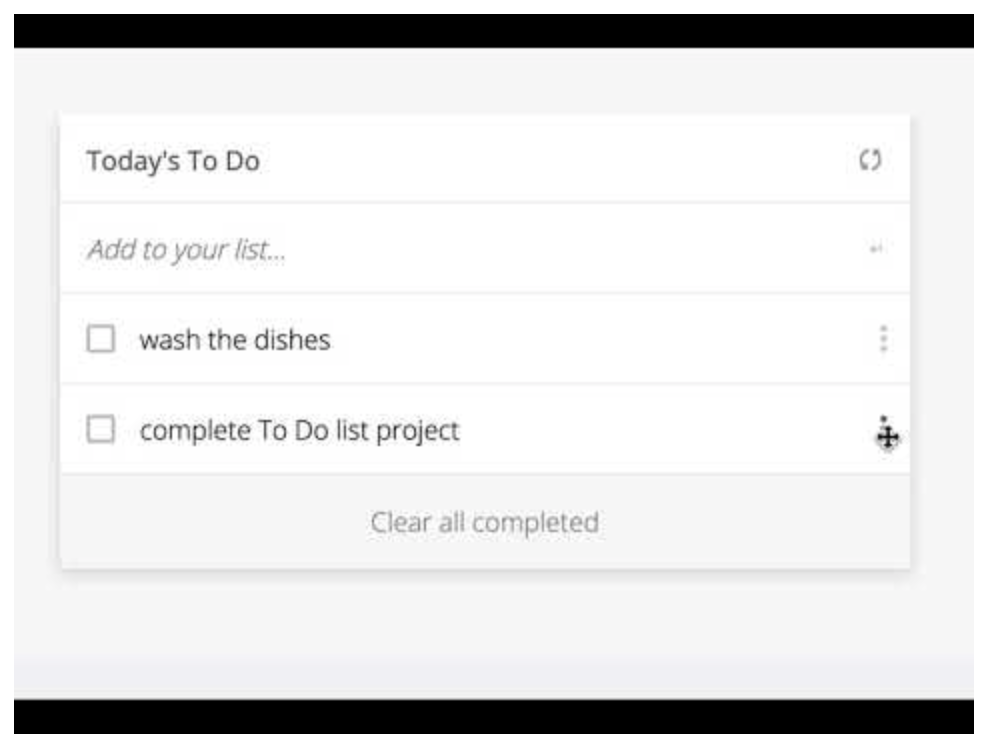

# To-do list

> "To-do list" is a tool that helps to organize your day. It simply lists the things that you need to do and allows you to mark them as complete.

Additional description about the project and its features.

## Built With

- HTML
- CSS
- JS

## Live Demo

[Live Demo Link](https://jihaneh.github.io/TodoList)

## Getting Started

Download the project, unzip it and open index.html file in the browser

## Authors

👤 **JihaneH**

- GitHub: [@jihaneH](https://github.com/jihaneH)
- Twitter: [@jijihaddad](https://twitter.com/jijihaddad)
- LinkedIn: [LinkedIn](https://linkedin.com/in/jihane-haddad/)

## 🤝 Contributing

Contributions, issues, and feature requests are welcome!

Feel free to check the [issues page](../../issues/).

## Show your support

Give a ⭐️ if you like this project!

## 📝 License

This project is [MIT](./MIT.md) licensed.
